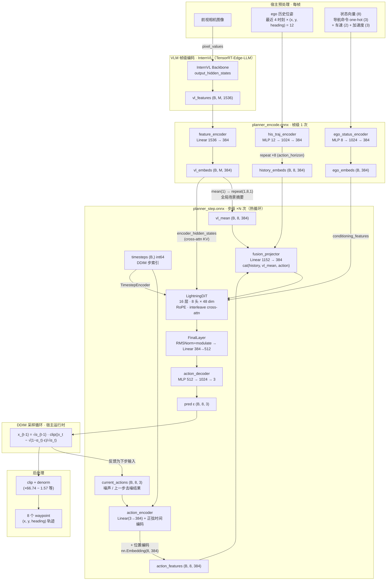
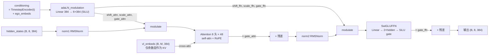

# Planner 模型结构

RecogDrive Planner 由帧级编码（`planner_encode.onnx`）与步级去噪（`planner_step.onnx`）两个 ONNX 组成，
VLM 特征（`vl_features`）由 TensorRT-Edge-LLM 单独部署产生。

## 整体结构（帧级 encode + 步级 DiT 循环）

## DiT 单层 block 内部（16 层重复，奇数层带 cross-attention）

## 关键点

- **时间条件注入两处**：`action_encoder` 的正弦时间编码（融合前），和 DiT 内 `TimestepEncoder`（384 维，与 `ego_embeds` 相加组成 conditioning，驱动 6 路 adaLN 调制）。
- **`vl_embeds` 三条路**：`mean` 摘要进 `fusion_projector`（query 侧全局条件）、完整序列做 cross-attention KV（每 2 层一次）、无直接调制。
- **位置编码**：waypoint 索引 `Embedding(8, 384)` 加在 action 特征上（在融合之前），因此 DiT 内注释掉的 `pos_embed` 不再使用。
- **循环边界清晰**：图内只有单步去噪网络，DDIM 更新、timesteps 递进、clip/denorm 全部在宿主运行时——即"网络进 engine、循环在框架层"的部署结构。

## 相关文件

- 导出脚本：`scripts/export_planner_onnx.py`
- DiT 定义：`navsim/agents/recogdrive/recogdrive_dit.py`
- C++ 推理：`TensorRT-Edge-LLM/cpp/action/recogdriveActionRunner.cpp`
